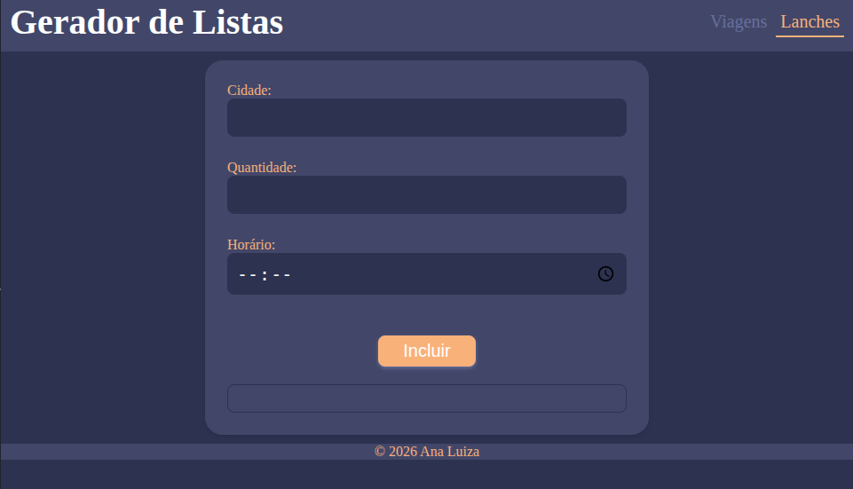

# 🚙 Gerador de Listas

Este projeto é um *formulário web* para listas de viagens, horários e lanches para transporte de pessoas, partiu de um problema real que tenho no meu serviço atual, sendo cansativo todo dia fazer a mão essas listas.  

   

## ⚒️ Funcionalidades

   
<b>Clique para ver os detalhes das listas</b>
 

   ### 🚌 Lista de Viagens
   * Campos: Cidade, Motorista, Carro/Veículo, Horário
   * Local do lanche calculado automaticamente
   * Checkbox para lanche especial

   ### 🍔 Lista de Lanches
   * Campos: Cidade, Quantidade, Horário
   * Soma total de lanches/pessoas

## ✨ Como Usar

  
Ver passo a passo de uso 📝

   1. [Acesse o Gerador de listas no GitHub Pages](https://aninha-jpg.github.io/gerador-listas/)
   2. Selecione qual lista você deseja criar. (ex: Viagens)
   2. Preencha os campos:
      * Cidade
      * Motorista
      * Carro
      * Horário (formato HH:MM)
   3. (Opcional) Marque o checkbox **para inserir um lanche fora do horário** se necessário.
   4. Clique em **Incluir**.
   5. A lista de viagens será exibida abaixo do formulário.

## 🚀 Status do Projeto

⚠️ **Em fase de testes e validação:** O projeto está sendo utilizado em ambiente real para coleta de feedback. 
* **Ajuste Recente:** Refatoração da lógica de manipulação de datas para garantir a virada correta de meses e anos (evitando erros de dias inexistentes como 32/03).

## 💻 Tecnologias utilizadas

* HTML5
* CSS3 (com variáveis e mobile-first)
* JavaScript (ES6+)

## ✨ Melhorias Futuras

- [x] Refatoração da lógica de calendário (correção da virada de mês/ano).
- [ ] **Modernização da UI/UX:** Atualmente em processo de alteração de paleta de cores e novo estilo visual.
- [ ] **Persistência de Dados:** Implementar banco de dados para relatórios mensais de lanches e viagens.
- [ ] **Integração:** Possibilidade de envio direto para WhatsApp.

